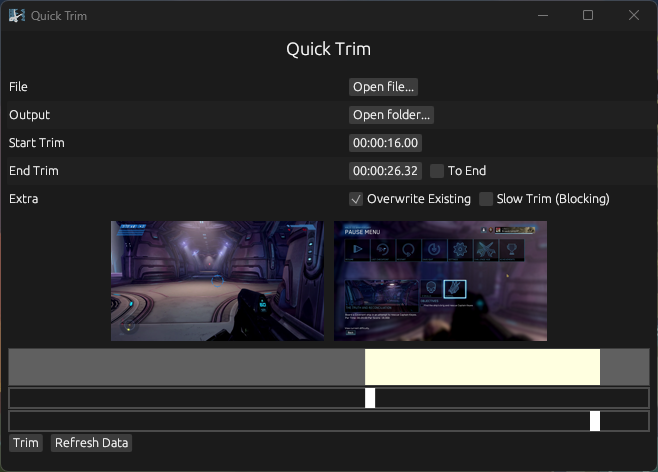

# quick_trim

An application to quickly trim videos visually.

###### The Clip in the Example Image Above is Gameplay of Halo: Combat Evolved Anniversary Edition, Recorded by Me.

#### Why?

I got tired of trying to find so many different ways to try and trim videos on my computer while also not downloading any new programs or uploading videos to random websites online so I decided to create my own lightweight application to do it the way I want.

`quick_trim` uses `ffmpeg` to trim and generate preview images and the GUI is created using `egui`.

#### Notes

Right now it is in a usable state, with a few things that could be improved. Due to limitations with `egui` (or most likely, my knowledge on `egui`), the two trim scrubbers have to be on separate lines. 

It also will freeze to try and load the preview frames if you load a video that is long. I want to make the preview frame loading and trimming async/multithreaded (I'm not sure which one to use) eventually so I can display a loading spinner when loading so users don't think the app has crashed.
